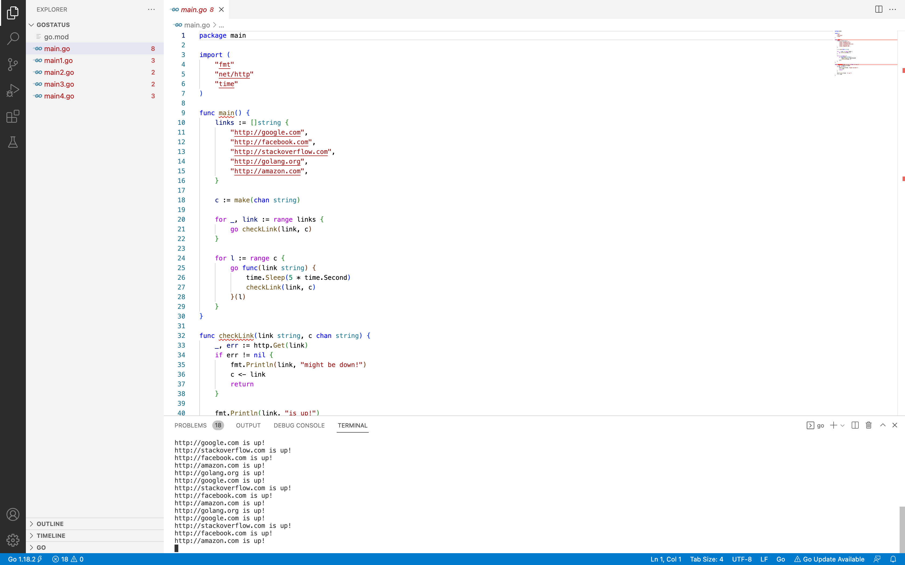

# GoStatus
This program is like a status checker for a list of websites that exists online. GoStatus takes a list of very common or popular websites and makes an HTTP Get Request to each of them to check whether they are up online and responding to HTTP Traffic.

